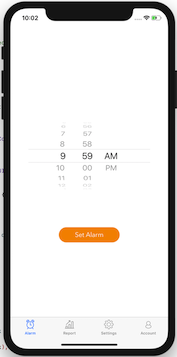
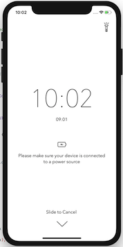
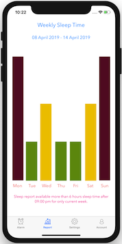
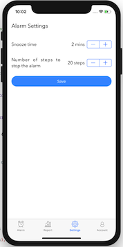

# WakeUp - Alarm Clock Application with Pedometer 




## Introduction

* The application is intended about the alarm. The alarm can be set normally after alarm time application will begin tracking step count. When the snooze period, step tracking goes on. After finish snooze time, the algorithm calculates steps taken, if step enough for stopping the alarm, the alarm will be invalidated, else new snooze time fired.
* Also for using user defaults (persistent container) setting save function can be used. In the setting section, the user can be set snooze time interval (such as after 2 mins, etc.) and the user can be set the step count for stopping the alarm.
* On the report tab, core data functionality used. For time limitation, only current week activities will be shown. The criteria about the report, sleep time should be after 9 pm and sleep duration should be more than 6 hours. This tab can be more productive in the future, such as monitoring all activities in the past, etc. (For testing report tab, you should uncomment saveCoreData function on Alarm / invalidate function).
* On account tab, API interactivity used. The user can create an account while entering the necessary information. Backup and restore functionality will be added in the future.
* The application must remain open during use and until it is stopped using the number of alarm steps. Therefore additional functionality is, when user set alarm, the proximity sensor will be activated. The display turns off when the phone is reversed to keep battery usage to a minimum.

## Documentation

* `SignInViewController`, `SignUpViewController` and `LoggedInViewController` is used for account management. `AccounController` is UINavigationController for redirecting proper account screen.
* `SetAlarmViewController` and `RunAlarmController` is used for setting and running alarm function.
* `SettingsViewController` is saving user's choicee for step count (needs to stopping alarm, after reaching this step count, alarm automatically will be stopped) and snooze interval time for re-triggering alarm after snooze button pushed.

## Usage

**Application directly up and running on iOS Simulator for alarm functionality.** The application is an alarm application. First, the alarm time is selected and the alarm is activated. When the alarm time arrives, the application plays the alarm sound. When the alarm sounds, the pedometer will start to control the number of steps being taken. The number of steps collected during the snooze time is calculated at the end of the delay time. If the number of steps is greater than the number of steps set by the user, the alarm stops automatically, if not, the delay function is available again.

**But for using and testing pedometer (step count) functionality, application needs to install on real device.**

Also for testing core data functionality the code below (in Alarm.swift file at invalidate method) can be uncomment for do not wait until alarm fire time.

```
// For testing core data, you can un-comment this line
// self.save()
```

## Authors

* **Giray Gencaslan**

## License

This project is licensed under the GNU General Public License v3.0 - see the [LICENSE.md](LICENSE.md) file for details
